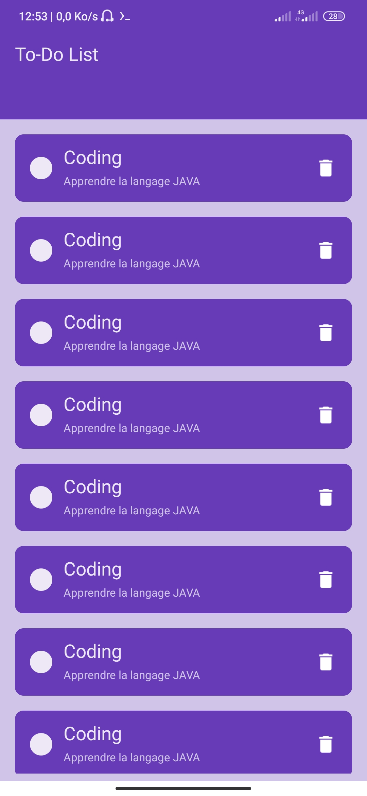

## Design UI TO-DO List
Description concise:
Application Android simple pour gérer ses tâches quotidiennes. Seulement le design pas de fonctionnalités comme ajout, suppression,...
Fonctionnalités principales:
### Technologies utilisées:
 * Langage: Java
 * Outils: Android Studio, XML
 * Prérequis:
   * Un environnement de développement Android (Android Studio)
   * Un émulateur ou un appareil Android
 * Cloner le projet:
   git clone https://github.com/aureando/design_ui_au.git

### Screenshots :
### Home 

